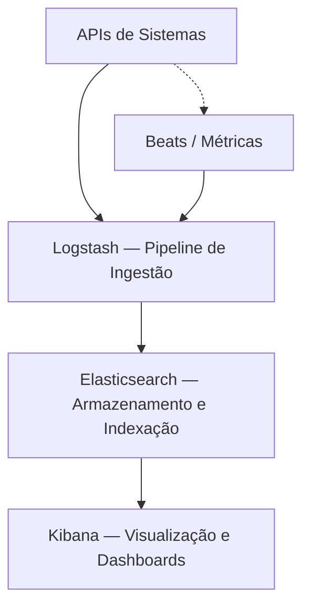

<div align="center">

# 📊 Plataforma de Observabilidade e Monitoramento
### Logs Centralizados · Métricas · Monitoramento em Tempo Real — com ELK Stack

[](https://www.elastic.co/elasticsearch/)
[](https://www.elastic.co/logstash/)
[](https://www.elastic.co/kibana/)
[](https://www.docker.com/)
[](#-notas)
[](#-licença)

**Uma plataforma de observabilidade backend inspirada em arquiteturas de produção utilizadas em sistemas distribuídos de larga escala, construída sobre o ELK Stack.**

[Visão Geral](#-visão-geral) •
[Objetivo](#-objetivo) •
[Arquitetura](#%EF%B8%8F-arquitetura-do-sistema) •
[Stack](#%EF%B8%8F-stack-tecnológica) •
[Componentes](#-componentes-da-pipeline) •
[Como Executar](#-como-executar)

</div>

---

## 🌐 Demonstração

🔗 **[benjaminreiis.github.io/monitoring-platform-](https://benjaminreiis.github.io/monitoring-platform-/)**

---

## 🔍 Visão Geral

Este projeto simula uma **plataforma centralizada de observabilidade**, inspirada em arquiteturas de produção utilizadas em sistemas distribuídos de larga escala.

A solução demonstra como logs, métricas e eventos de múltiplas aplicações podem ser **centralizados**, **processados** e **visualizados** em um único ponto de análise, usando o ecossistema **ELK Stack** (Elasticsearch, Logstash, Kibana).

O projeto cobre quatro pilares de observabilidade:

- 📝 **Logs estruturados**
- 📈 **Métricas de sistemas**
- ⏱️ **Monitoramento em tempo real**
- 📊 **Visualização de dados operacionais**

---

## 🧠 Objetivo

Fornecer uma estrutura conceitual de observabilidade para sistemas backend, permitindo:

- 🗂️ Centralização de logs
- 📡 Coleta de métricas
- ⚙️ Monitoramento de performance
- 🖥️ Visualização de dados operacionais

---

## 🏗️ Arquitetura do Sistema

```text
APIs de Sistemas
        │
        ▼
Pipeline de Logs / Métricas
        │
 ┌───────────────┬───────────────┐
 ▼               ▼               ▼
Logs         Métricas        Eventos
Pipeline     Collector       Stream
        │               │               │
        └───────────────┴───────────────┘
                        │
                        ▼
        Sistema de Armazenamento e Visualização
```

### Fluxo com o ELK Stack



### Camadas da Arquitetura

| Camada | Componente | Responsabilidade |
|---|---|---|
| **Origem dos dados** | APIs de Sistemas | Geram logs, métricas e eventos a serem monitorados |
| **Ingestão** | Logstash | Coleta, transforma (parse, filtros) e envia os dados para o armazenamento |
| **Coleta de Métricas** | Metricbeat / Filebeat | Agentes leves para coleta de métricas de sistema e logs de arquivo |
| **Armazenamento e Indexação** | Elasticsearch | Armazena e indexa logs, métricas e eventos para busca rápida |
| **Visualização** | Kibana | Dashboards, gráficos e exploração interativa dos dados operacionais |

---

## ⚙️ Stack Tecnológica

| Tecnologia | Função no projeto |
|---|---|
| **Elasticsearch** | Motor de busca e armazenamento distribuído dos dados de observabilidade |
| **Logstash** | Pipeline de ingestão, parsing e transformação de logs/eventos |
| **Kibana** | Interface de visualização, dashboards e exploração dos dados |
| **Beats (Filebeat/Metricbeat)** | Agentes leves de coleta, instalados junto às aplicações monitoradas |
| **Docker / Docker Compose** | Orquestração do ambiente local do ELK Stack |

---

## 🧩 Componentes da Pipeline

### 📝 Logs Pipeline
Responsável por receber logs estruturados (JSON) das APIs monitoradas, aplicar parsing e enriquecimento (timestamp, nível de log, serviço de origem) e enviá-los ao Elasticsearch via Logstash.

### 📈 Métricas Collector
Coleta métricas de performance dos sistemas monitorados — uso de CPU, memória, latência de requisições, taxa de erro — geralmente via **Metricbeat**, com envio periódico para indexação.

### ⏱️ Eventos Stream
Captura eventos de negócio ou de sistema em tempo real (ex: falhas, alertas, mudanças de estado), permitindo correlação posterior com logs e métricas no mesmo intervalo de tempo.

### 🖥️ Sistema de Armazenamento e Visualização
O **Elasticsearch** centraliza e indexa todo o dado recebido, enquanto o **Kibana** oferece dashboards para:
- Busca e filtragem de logs por serviço, nível ou período
- Gráficos de métricas de performance ao longo do tempo
- Correlação entre eventos e anomalias do sistema

---

## 📂 Estrutura do Projeto (sugerida)

```text
monitoring-platform/
│
├── logstash/
│   ├── pipeline/
│   │   └── logstash.conf       # Configuração de input, filter e output
│   └── config/
│       └── logstash.yml
│
├── elasticsearch/
│   └── config/
│       └── elasticsearch.yml
│
├── kibana/
│   └── config/
│       └── kibana.yml
│
├── beats/
│   ├── filebeat.yml
│   └── metricbeat.yml
│
├── docker-compose.yml
└── README.md
```

---

## 🚀 Como Executar

> ⚠️ Estrutura conceitual — adapte os arquivos de configuração ao seu ambiente real antes de usar em produção.

### Pré-requisitos
- [Docker](https://www.docker.com/) e Docker Compose
- Pelo menos 4GB de RAM disponível para os containers do ELK Stack

### 1. Clone o repositório
```bash
git clone https://github.com/benjaminreiis/monitoring-platform-.git
cd monitoring-platform
```

### 2. Suba o ambiente ELK
```bash
docker-compose up -d
```

### 3. Acesse as interfaces

| Serviço | URL padrão |
|---|---|
| Kibana | `http://localhost:5601` |
| Elasticsearch | `http://localhost:9200` |

### 4. Envie logs de exemplo
```bash
curl -X POST "http://localhost:9200/logs-app/_doc" \
  -H "Content-Type: application/json" \
  -d '{
    "timestamp": "2026-06-29T12:00:00Z",
    "service": "payment-api",
    "level": "INFO",
    "message": "Transação processada com sucesso"
  }'
```

---

## 📌 Notas

> Este projeto tem como foco demonstrar **conceitos de observabilidade e arquitetura de monitoramento distribuído**, inspirado em práticas reais de produção. A estrutura representa o desenho-alvo da plataforma; os arquivos de configuração do ELK Stack (pipelines do Logstash, mapeamentos do Elasticsearch, dashboards do Kibana) podem precisar de ajustes finos conforme as aplicações monitoradas.

---

## 🗺️ Roadmap

- [ ] Pipelines de parsing do Logstash para formatos de log específicos
- [ ] Dashboards pré-configurados no Kibana (importáveis via NDJSON)
- [ ] Alertas automáticos (Elastic Alerting / Watcher)
- [ ] Retenção e ciclo de vida de índices (ILM — Index Lifecycle Management)
- [ ] Integração com tracing distribuído (APM)
- [ ] Autenticação e controle de acesso (X-Pack Security)

---

## 🤝 Como Contribuir

1. Faça um fork do projeto
2. Crie uma branch (`git checkout -b feature/minha-feature`)
3. Commit suas alterações (`git commit -m 'feat: adiciona minha feature'`)
4. Push para a branch (`git push origin feature/minha-feature`)
5. Abra um Pull Request

---

## 👨‍💻 Autor

**Benjamin Reis**

[](https://github.com/benjaminreiis)

---

## 📄 Licença

Este projeto está sob a licença MIT. Veja o arquivo [LICENSE](LICENSE) para mais detalhes.

---

<div align="center">

⭐ Se este projeto foi útil, considere deixar uma estrela no repositório!

</div>
